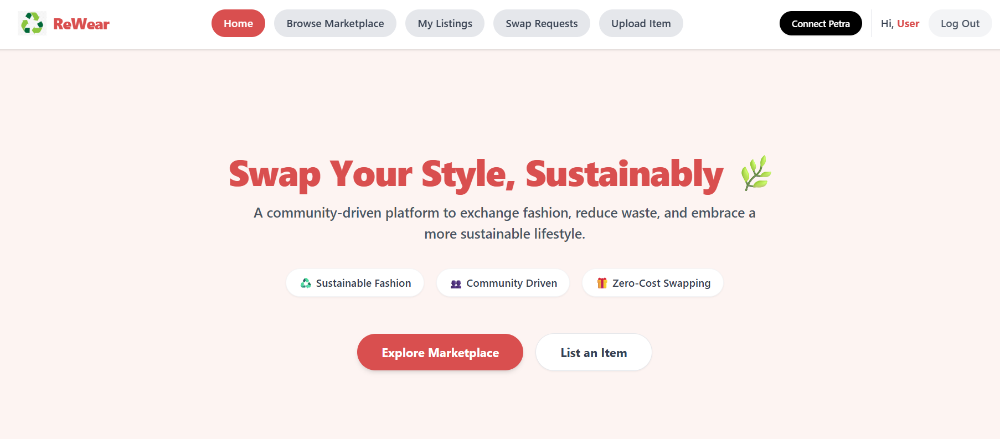
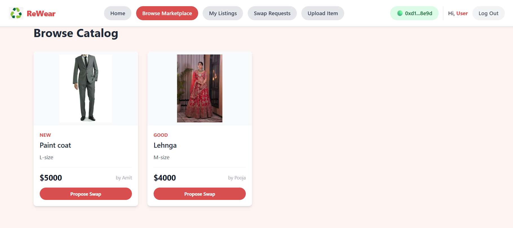
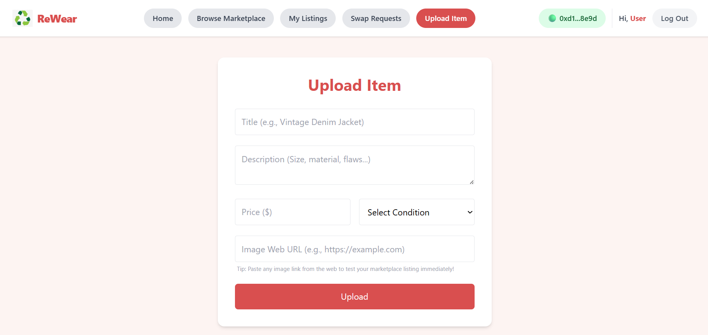
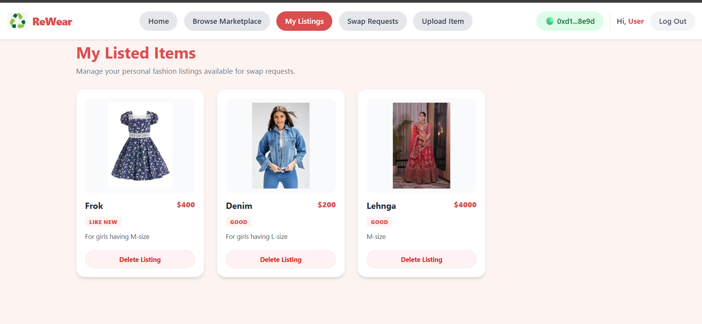
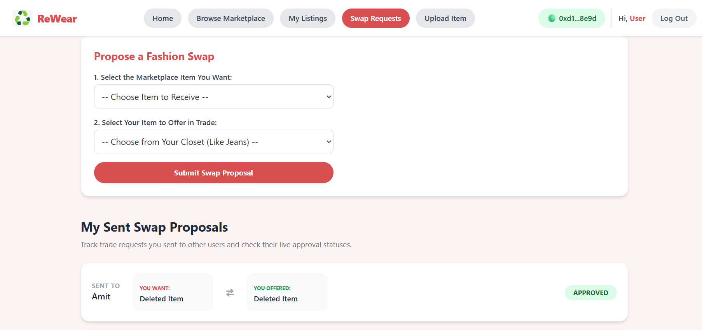
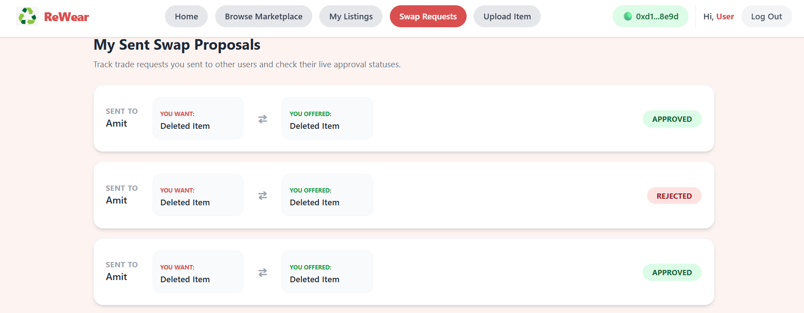
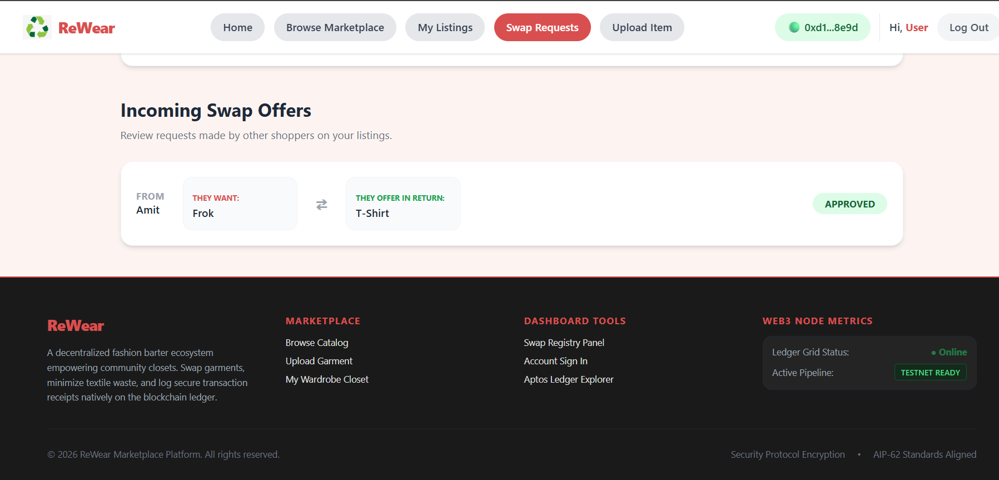

# 🔄 ReWear - Web3 Clothing Marketplace & Swap Platform

ReWear is a decentralized sustainable fashion marketplace where users can list, browse, and swap clothing items using the Aptos blockchain network.

---

## 📸 Application Screenshots

### 🏠 Home Page


### 🛒 Browse Marketplace


### 📦 My Listings & Uploads
<p align="center">
  
  
</p>

### 🔄 Swap Management Dashboard
Review incoming offers, proposed trades, and tracking metrics.
* **Propose Swap:**  
  
* **Sent & Incoming Requests:**  
  <p align="center">
    
    
  </p>

---

## ✨ Features

- **Traditional Auth & Web3 Bridging:** Accessible sign-up/login combined with an Aptos cryptocurrency wallet connection.
- **Dynamic Marketplace Feed:** Interactive cards displaying product condition tags, pricing metrics, and instant live image previews.
- **Decentralized Bartering:** Propose peer-to-peer wardrobe swaps directly through dashboard tracking flows.

---

## 🛠️ Tech Stack

- **Frontend:** React, Tailwind CSS, Vite, Lucide React, React Router DOM
- **State & Data Management:** Axios HTTP Client, HTML5 LocalStorage API
- **Web3 Ecosystem:** `@aptos-labs/wallet-adapter-react` (Petra Wallet Core Integration)
- **Backend:** Node.js, Express API Server

---

## 🚀 Getting Started

### 1. Prerequisites
- Install [Node.js](https://nodejs.org)
- Install a Web3 wallet extension like [Petra Aptos Wallet](https://petra.app)

### 2. Installation
Clone the repository and install frontend dependencies:
```bash
npm install
```

### 3. Server Configuration
Navigate to the server directory and install backend packages:
```bash
cd server
npm install
```
Create a `.env` file inside the `server` directory:
```env
PORT=5000
JWT_SECRET=your_jwt_secret_key
```

### 4. Running Locally
Start your backend environment:
```bash
# Inside /server directory
npm run dev
```
Open a separate terminal split window and run the frontend build engine:
```bash
# Inside root project directory
npm run dev
```
